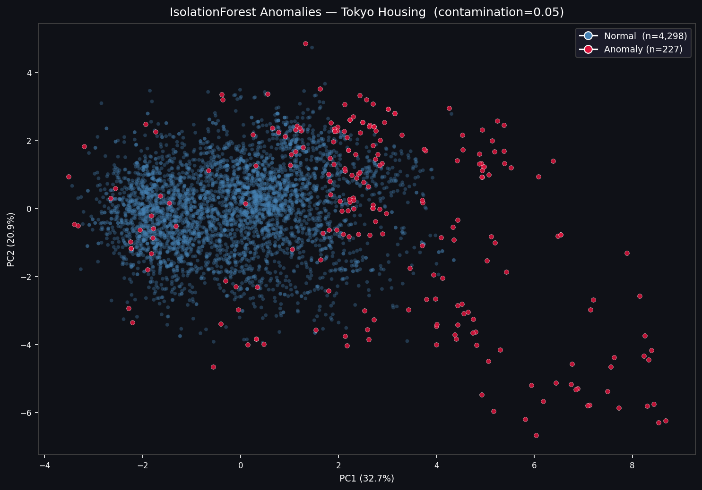
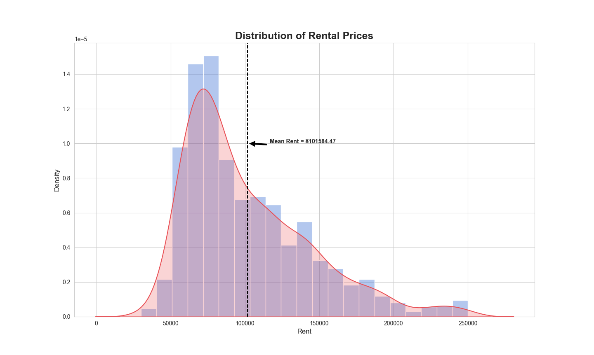
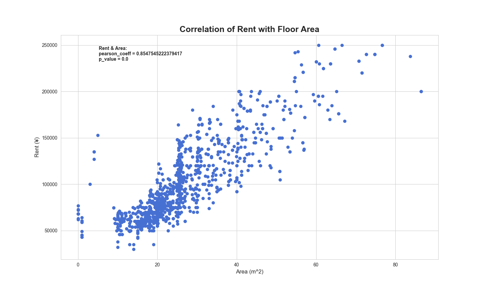
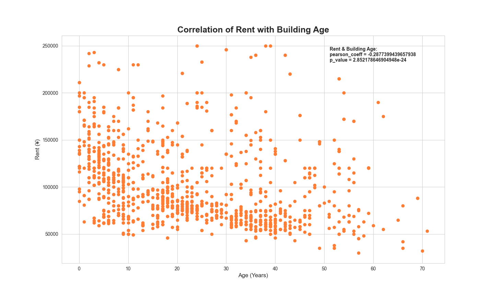
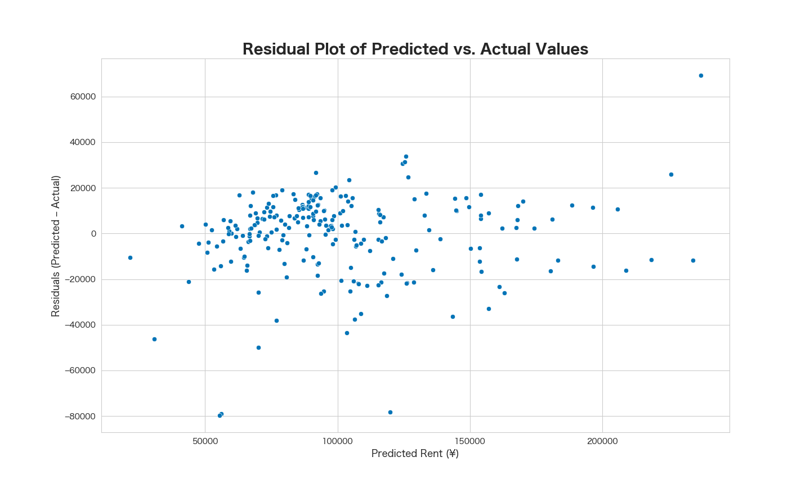

# 🏙️ Tokyo Rental Market Intelligence & Price Forecasting

A full end-to-end data analytics project covering web scraping, SQL feature engineering, exploratory data analysis, predictive modeling, and anomaly detection — applied to Tokyo's rental housing market. Built to support practical housing decisions for incoming field staff relocating to the Nakai area.

The project has two layers:
- **v1 — Analysis** (`notebooks/`): the original EDA and linear regression work
- **v2 — Automated Pipeline** (`pipeline/`): a production-style multi-agent system that scrapes, loads, transforms, scores anomalies, and regenerates an interactive dashboard on a weekly cron schedule

---

## 📋 Table of Contents

- [Project Overview](#project-overview)
- [Live Dashboard](#live-dashboard)
- [Pipeline Architecture](#pipeline-architecture)
- [Setup & Usage](#setup--usage)
- [Business Context & Impact](#business-context--impact)
- [Tech Stack](#tech-stack)
- [Key Metrics & Findings](#key-metrics--findings)
- [Market Overview](#market-overview)
- [Anomaly Detection](#anomaly-detection)
- [Model Performance](#model-performance)
- [Visualizations](#visualizations)
- [Limitations & Future Work](#limitations--future-work)
- [Repository Structure](#repository-structure)

---

## Project Overview

This project scrapes, cleans, engineers, and models Tokyo rental listings from *SUUMO.jp* — Japan's largest real estate platform — with a focus on the Nakai neighborhood and surrounding stations. The pipeline collects ~5,000 listings, processes them through a multi-stage SQL view, applies pandas transforms and Isolation Forest anomaly detection, and feeds a multivariate linear regression model capable of explaining **88% of rental price variance** on unseen data.

The original analysis is structured as four sequential notebooks plus a companion Excel workbook (`TokyoRentalMarketOverview.xlsx`):

| Notebook | Description |
|---|---|
| `01_data_collection_and_cleaning` | Web scraping with `BeautifulSoup`, SQLite ingestion, SQL view with feature engineering |
| `02_exploratory_data_analysis` | Distribution analysis, Pearson correlations, confidence intervals, 8 EDA visualizations |
| `03_modeling_and_evaluation` | Linear regression (simple + multiple), one-hot encoding, cross-validation, residual analysis |
| `04_insights_limitations_and_conclusion` | Business-facing summary of findings, limitations, and next steps |

---

## Live Dashboard

**[chadmgallego.github.io/tokyo-housing-analysis](https://chadmgallego.github.io/tokyo-housing-analysis)**

Also available as a self-contained HTML file at `reports/tokyo_rental_dashboard.html` — no server needed, open it in any browser.

- 4,500+ filterable listings from West Tokyo
- Filters: floor plan, area (binned), station, building age, anomaly status
- KPI cards: total listings, median rent, anomaly count, median area, median building age
- 6 charts: floor plan distribution, avg rent by floor plan, rent by area, building age distribution, top stations by rent, rent vs walk time
- Paginated listings table (20 per page) with sortable columns, clickable links to source listings, and anomaly label + score columns

---

## Pipeline Architecture

The v2 pipeline is built as five sequential agents coordinated by a single orchestrator. Each agent returns a structured result dict (`{"status": "VALID/ERROR", "message": ..., "data": ...}`), writes a timestamped JSON log, and passes its output to the next stage in memory. The orchestrator applies fail-fast logic — any agent failure halts the pipeline immediately with a clear error message.

```
SUUMO.jp
    │
    ▼
ListingsScraperAgent
    Paginates all listing pages; returns raw BeautifulSoup Tag objects.
    Handles rate limiting (1.5s delay), HTTP errors, and empty pages.
    │
    ▼
ListingsParserAgent
    Extracts unit-level fields (rent, area, floor plan, floor, etc.) from HTML.
    Computes nearest station and average walk distance across all served stations.
    Drops sublistings missing all critical fields (rent, area, floor plan).
    │
    ▼
ListingsLoaderAgent
    Loads raw DataFrame into Supabase (housing_data_raw).
    Drops and recreates the tokyo_housing SQL view via a multi-CTE script:
      ├── DEDUPLICATED_LISTINGS   — ROW_NUMBER() deduplication
      ├── STANDARDIZED_LISTINGS   — type casting, unit normalization, floor plan mapping
      └── FEATURED_LISTINGS       — window functions: avg rent by station/floor plan,
                                    listing counts per station/floor plan
    │
    ▼
ListingsTransformerAgent
    Queries the cleaned view from Supabase.
    Applies transforms that can't be done cleanly in SQL:
      ├── Floor range expansion — "2-4F" exploded into rows: 2, 3, 4
      └── Building size parsing — "地下1地上14階建" summed to 15 total floors
    │
    ▼
AnomalyDetectionAgent
    Runs Isolation Forest on numeric + encoded floor plan features.
    Generates a PCA scatter plot (normal vs anomaly) saved to pipeline/agents/figs/.
    Appends anomaly_label (-1 / 1) and anomaly_score to the DataFrame.
    │
    ├── pipeline/dataset_results/final_housing_results_{timestamp}.csv
    └── pipeline/agents/figs/anomaly_pca_{timestamp}.png
    │
    ▼
generate_dashboard.py
    Reads the most recent CSV from dataset_results/ (by filename).
    Skips regeneration if the file hasn't changed since last run.
    ├── reports/tokyo_rental_dashboard.html
    └── docs/index.html  (GitHub Pages — auto-updated on push)


AgentOrchestratorAgent  ←  single entry point that runs all 5 stages above
    Logs a per-run orchestrator_log_{timestamp}.json on success or failure.
```

Each agent also writes its own timestamped log to `pipeline/agents/logs/`:

| Log file | Written by |
|---|---|
| `scraper_log_{ts}.json` | ListingsScraperAgent |
| `parser_log_{ts}.json` | ListingsParserAgent |
| `loader_log_{ts}.json` | ListingsLoaderAgent |
| `transformer_log_query_{ts}.json` | ListingsTransformerAgent (query step) |
| `transformer_log_transform_{ts}.json` | ListingsTransformerAgent (transform step) |
| `anomaly_log_{ts}.json` | AnomalyDetectionAgent |
| `orchestrator_log_{ts}.json` | AgentOrchestratorAgent |

---

## Setup & Usage

**Requirements:**
```bash
pip install -r requirements.txt
```

**Credentials** — copy `.env.example` to `.env` and fill in your Supabase values (`.env` is never committed):
```bash
cp .env.example .env
```
```
SUPABASE_HOST=db.xxxxxxxxxxxx.supabase.co
SUPABASE_PORT=5432
SUPABASE_DB=postgres
SUPABASE_USER=postgres
SUPABASE_PASSWORD=your-password-here
```
Find these in: Supabase dashboard → Project Settings → Database → Connection parameters.

**Run the full pipeline (recommended):**
```bash
python3 pipeline/agents/agent_orchestrator_agent.py
```

**Run individual agents:**
```bash
python3 pipeline/agents/listings_scraper_agent.py
python3 pipeline/agents/listings_loader_agent.py
python3 pipeline/agents/listings_transformer_agent.py
python3 pipeline/agents/anomaly_detection_agent.py
```

**Regenerate the dashboard from the latest results:**
```bash
python3 pipeline/generate_dashboard.py
```

**Recommended cron schedule** (scrape Sunday 5am, regenerate dashboard 6am):
```bash
0 5 * * 0 python3 /path/to/pipeline/agents/agent_orchestrator_agent.py >> pipeline.log 2>&1
0 6 * * 0 python3 /path/to/pipeline/generate_dashboard.py >> dashboard.log 2>&1
```

---

## Business Context & Impact

Field staff relocating to Tokyo face a fragmented, Japanese-language rental market with limited visibility into what drives pricing. This project addresses that gap directly:

- **Establishes a market baseline** — average rent of ¥129,149/month with a 95% CI of ±¥1,941, giving staff a statistically grounded budget expectation
- **Quantifies what matters** — identifies `area` as the dominant pricing driver (Pearson r = 0.881), freeing staff from over-weighting factors like station proximity that have minimal real-world impact
- **Flags pricing outliers** — Isolation Forest surfaces listings that are statistically anomalous relative to similar units, helping staff avoid overpriced listings and spot underpriced opportunities
- **Delivers a rent estimation tool** — the regression model predicts rent from key unit characteristics, supporting informed negotiation and housing prioritization before arrival
- **Surfaces non-obvious insights** — station proximity and specific station choice showed near-zero correlation with rent (r ≈ 0.09 and 0.00 respectively), countering a common assumption in Tokyo housing search
- **Provides station- and floor plan-level market tables** — the companion Excel workbook enables direct comparison of median rents, building ages, and unit types across 20+ stations and 15+ floor plan categories

---

## Tech Stack

| Category | Tools |
|---|---|
| **Data Collection** | Python, `requests`, `BeautifulSoup`, `lxml`, `re` |
| **Storage (v1)** | SQLite, SQL Magic (`%sql`) |
| **Storage (v2)** | Supabase / PostgreSQL, `psycopg2-binary`, `SQLAlchemy` |
| **Data Processing** | `pandas`, `numpy` |
| **Feature Engineering** | Raw SQL (CTEs, window functions, `PARTITION BY`, `REGEXP_REPLACE`) |
| **EDA & Visualization** | `matplotlib`, `seaborn` |
| **Modeling** | `scikit-learn` — `LinearRegression`, `StandardScaler`, `OneHotEncoder`, `cross_val_score` |
| **Anomaly Detection** | `scikit-learn` — `IsolationForest`, `PCA`, `StandardScaler` |
| **Statistics** | `scipy.stats` — Pearson correlation, z-test, confidence intervals |
| **Pipeline** | OOP multi-agent architecture, fail-fast orchestration, per-run JSON logging |
| **Dashboard** | Chart.js, client-side JS (filtering, sorting, pagination) |
| **Reporting** | Excel (pivot tables, summary tables, chart data) |
| **Automation** | cron, `argparse`, filename-based change detection |

---

## Key Metrics & Findings

### Rental Price Distribution
- **Mean rent:** ¥129,149/month
- **95% confidence interval:** ¥129,149 ± ¥1,941
- **Distribution shape:** Right-skewed — most listings fall below the mean, with a long tail of premium units pulling the average upward
- **Sample size:** 4,772 listings (post-deduplication)

### Feature Correlations with Rent

| Feature | Pearson r | Interpretation |
|---|---|---|
| `area` | **+0.881** | Strongest driver — larger units command significantly higher rents |
| `building_age` | **−0.400** | Newer buildings are meaningfully more expensive |
| `building_size` | **+0.340** | Taller buildings tend to price higher |
| `floor` | **+0.290** | Higher floors correlate with higher rents |
| `distance_to_nearest_station` | **+0.090** | Negligible — station proximity is not a meaningful price driver |
| `avg_distance_to_stations` | **+0.003** | No meaningful relationship with rent |

**Notable finding:** Station proximity — often cited as a top factor in Tokyo housing — showed near-zero correlation with rent in this dataset. Rent appears to be driven almost entirely by unit characteristics, not location within the Nakai area.

---

## Market Overview

Full station- and floor plan-level summary tables are available in [`reports/TokyoRentalMarketOverview.xlsx`](reports/TokyoRentalMarketOverview.xlsx). Key highlights below.

**By station** (top stations by listing volume, 100+ listings):

- **中井駅 (Nakai)** — the primary target area — has 335 listings at a median rent of ¥91,000 with a 5-minute walk and 20-year median building age; one of the most affordable well-connected stations in the dataset
- **沼袋駅 (Numabukuro)** offers the lowest median rent (¥75,000) among high-volume stations, though stock skews older (21-year median age) and smaller (1R dominant)
- **高田馬場駅 (Takadanobaba)** commands the highest median rent at ¥148,000 — newer stock, larger unit mix
- **新江古田駅 (Shin-Egota)** stands out for its newest median building age (1 year) at a moderate ¥115,500 median rent — a potential value option for staff prioritizing newer construction
- Despite a ¥75,000–¥148,000 spread across stations, the correlation between station and rent is near zero — unit characteristics dominate

**By floor plan:**

- **1K and 1R** account for 2,697 listings — over half the dataset — making them the most available options for single-person staff at median rents of ¥90,000 and ¥70,000 respectively
- The step from **1K → 1LDK** costs roughly ¥74,500/month more (+83%) for ~17 additional m² — a significant cost-per-area premium for adding a living room
- **2LDK and 3LDK** serve couples and families at median rents of ¥238,000 and ¥283,000, but supply is limited and price variability is high

**By building age:**

- Newly constructed buildings average **¥182,680** — more than 2.5× the ¥72,107 average for 61+ year-old buildings
- The steepest discount occurs in the first 30 years; after that, the curve flattens significantly

---

## Anomaly Detection

The `AnomalyDetectionAgent` applies **Isolation Forest** to flag listings that are statistically anomalous relative to similar units — surfacing both overpriced and underpriced outliers that simple filters would miss.

**How it works:**
- Features used: `rent`, `area`, `floor`, `building_age`, `building_size`, `distance_to_nearest_station`, `avg_distance_to_stations`, `management_fee`, `floor_plan` (one-hot encoded)
- All numeric features are standardized with `StandardScaler` before fitting
- `contamination=0.05` — flags the 5% of listings most inconsistent with the overall feature distribution
- Each listing receives an `anomaly_label` (-1 = anomaly, 1 = normal) and an `anomaly_score` (more negative = stronger anomaly)
- A PCA scatter plot is generated each run and saved to `pipeline/agents/figs/`

**Results (latest run):**
- **227 anomalies** flagged out of 4,525 listings (5.0%)
- Anomalies are filterable and sortable in the live dashboard — sort by `Score` ascending to see the most confident flags

**Reading the score:**
| Score range | Meaning |
|---|---|
| `> 0` | Normal — confidently within the expected distribution |
| `≈ 0` | Borderline — the model is uncertain |
| `< 0` | Anomaly — the more negative, the stronger the flag |


> PCA projection of all listings. Crimson points are Isolation Forest anomalies — listings whose combination of features is inconsistent with the broader market. Most anomalies cluster at the periphery of the normal distribution, consistent with outlier behavior.

---

## Model Performance

### Simple Linear Regression (Area Only — Baseline)

| Metric | Value |
|---|---|
| 5-fold CV R² (avg) | **0.779** |

### Multiple Linear Regression (All Features)

| Metric | Value |
|---|---|
| 5-fold CV R² (avg) | **0.889** |
| Training set R² | **0.893** |
| Test set R² | **0.880** |

The jump from 77.9% to 88.9% R² demonstrates meaningful lift from adding `building_age`, `building_size`, `floor`, and `floor_plan` alongside `area`. The close alignment between training (89.3%) and test (88.0%) performance confirms the model generalizes well without overfitting.

### Top Coefficients (Standardized)

| Feature | Coefficient | Direction |
|---|---|---|
| `area` | 39,955 | ↑ Strongest positive driver |
| `building_age` | −16,628 | ↓ Older buildings significantly cheaper |
| `floor_plan_2LDK` | 10,428 | ↑ Large premium for 2LDK layouts |
| `floor_plan_3LDK` | 9,856 | ↑ Similar premium for 3LDK |
| `building_size` | 8,827 | ↑ Taller buildings price higher |
| `floor` | 2,751 | ↑ Higher floors modestly increase rent |
| `floor_plan_1K` | −3,930 | ↓ Discount relative to 1DK baseline |

---

## Visualizations

### Distribution of Rental Prices

> Right-skewed distribution with a mean of ¥129,149. The median sits below the mean, pulled upward by a small number of premium listings — a useful reminder that average rent overstates typical cost for most staff.

---

### Correlation of Rent with Floor Area

> Pearson r = 0.881 — the strongest predictor in the dataset by a wide margin. The fan-shaped spread at larger areas reflects increasing price variability for bigger units, but the linear trend is clear throughout.

---

### Correlation of Rent with Building Age

> Pearson r = −0.400. Newer buildings are consistently more expensive, with the steepest discount occurring in the first 30 years. Staff prioritizing budget over modernity have the most options in the 20–40 year age range.

---

### Distribution of Residuals

> Residuals are centered near zero with an approximately symmetric, bell-shaped profile — consistent with linear regression assumptions. Extreme outliers on the left tail correspond to high-rent listings where the model under-predicts, suggesting that a budget-capped dataset would further improve accuracy for practical use.

---

## Limitations & Future Work

**Current limitations:**

- **Partial market coverage** — SUUMO's pagination structure limits exhaustive scraping; ~5,000 listings represent a sample, not the full market
- **Assumed linearity** — scatter plots reveal some nonlinear patterns (particularly for `area` and `building_age`) that a linear model cannot fully capture
- **Single anomaly threshold** — `contamination=0.05` is a fixed assumption; the optimal threshold depends on how aggressively you want to flag outliers

**Planned improvements:**

- Gradient boosting model (XGBoost or LightGBM) as a higher-accuracy alternative to linear regression — better handles nonlinear interactions between `area`, `building_age`, and `floor_plan`
- Polynomial feature transformations with Ridge/Lasso regularization to capture nonlinear `area` and `building_age` effects within the linear framework
- Price trend tracking — the weekly scrape infrastructure is in place; adding a time-series layer would surface how rents shift across seasons
- Contamination sweep — determine the optimal Isolation Forest threshold empirically rather than fixing it at 5%
- Budget-filtered modeling — a model trained only on listings below a practical rent ceiling would likely improve accuracy for the core staff use case

---

## Repository Structure

```
tokyo-housing-analysis/
├── notebooks/                              # v1 — original analysis
│   ├── 01_data_collection_and_cleaning.ipynb
│   ├── 02_exploratory_data_analysis.ipynb
│   ├── 03_modeling_and_evaluation.ipynb
│   └── 04_insights_limitations_and_conclusion.ipynb
├── src/                                    # v1 — original scraper
│   ├── housing_scraper.py
│   └── housing_scraper.ipynb
├── sql/
│   ├── data_cleaning_and_features_sqlite.sql      # Feature engineering view (SQLite / v1)
│   └── data_cleaning_and_features_postgresql.sql  # Feature engineering view (PostgreSQL / v2)
├── pipeline/                               # v2 — automated pipeline
│   ├── agents/
│   │   ├── agent_orchestrator_agent.py     # Entry point — chains all 5 agents
│   │   ├── listings_scraper_agent.py       # Stage 1 — scrape SUUMO listings
│   │   ├── listings_parser_agent.py        # Stage 2 — parse HTML into flat dicts
│   │   ├── listings_loader_agent.py        # Stage 3 — load to Supabase, create SQL view
│   │   ├── listings_transformer_agent.py   # Stage 4 — pandas transforms (floor, building size)
│   │   ├── anomaly_detection_agent.py      # Stage 5 — Isolation Forest anomaly scoring
│   │   ├── figs/                           # PCA scatter plots (one per run)
│   │   └── logs/                           # Per-agent timestamped JSON logs (gitignored)
│   ├── dataset_results/                    # Final CSVs with anomaly scores (one per run)
│   └── generate_dashboard.py              # Reads latest CSV → HTML dashboard
├── data/
│   ├── processed/
│   │   ├── coef_table.csv
│   │   ├── model_residuals.csv
│   │   └── tokyo_housing.csv
│   └── raw/
│       └── housing_data_raw.csv
├── figures/                                # EDA and model visualizations
├── docs/
│   └── index.html                          # GitHub Pages — live dashboard
├── reports/
│   ├── tokyo_rental_dashboard.html         # Local copy of dashboard
│   └── TokyoRentalMarketOverview.xlsx
├── requirements.txt
├── .env.example                            # Credential template (copy to .env)
└── README.md
```

---

*Data sourced from SUUMO.jp. All analysis performed on listings in the Nakai neighborhood and surrounding area of Tokyo, Japan.*
